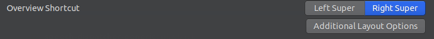
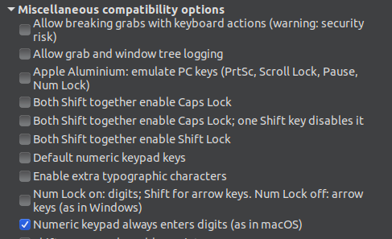
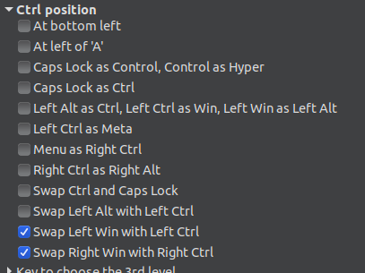
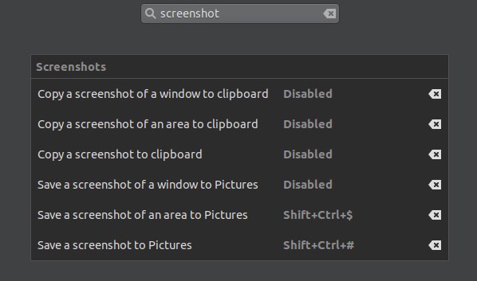
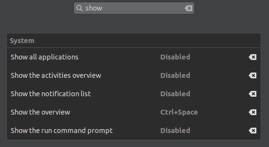
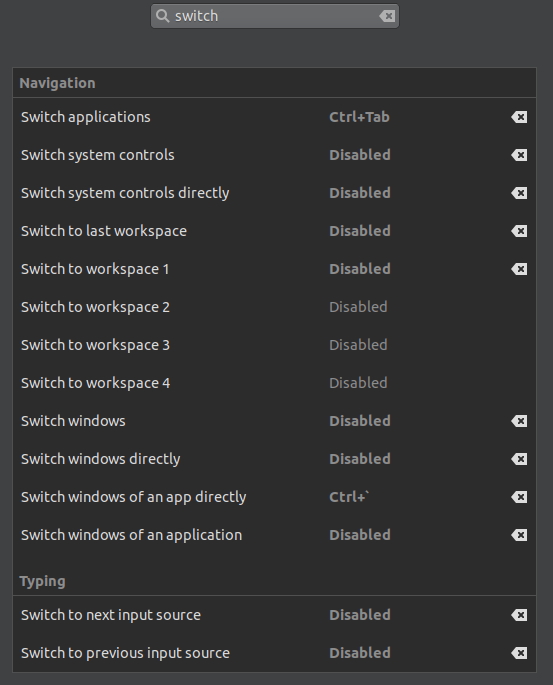
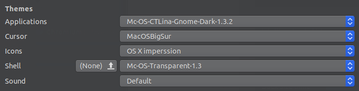

# Mac Style Ubuntu

This is with Gnome on Ubuntu `20.04` with an Apple keyboard.

# Install software

- Gnome Tweaks
  ```bash
  sudo apt install gnome-tweak-tool
  ```
- Gnome Shell extensions browser plugin
  - Firefox: https://addons.mozilla.org/en-US/firefox/addon/gnome-shell-integration/
  - Chrome: https://chrome.google.com/webstore/detail/gnome-shell-integration/gphhapmejobijbbhgpjhcjognlahblep
- AutoKey
  ```bash
  sudo apt-get install autokey-gtk
  ```

# Connect AirPods

1. ```bash
   sudo nano /etc/bluetooth/main.conf
   ```
2. Add `ControllerMode = bredr`
3. ```bash
   sudo /etc/init.d/bluetooth restart
   ```
4. Make sure bluetooth is on and pair them.

# Install font

1. Download the Roboto font: https://fonts.google.com/specimen/Roboto
2. Drag the folder to `/usr/share/fonts/truetype`
3. Open Tweaks
4. Go to `Fonts`
5. Set all the fonts except `Monospace Text` to `Roboto Medium`.

# Modifier key layout and numpad

1. Open Tweaks (`gnome-tweak-tool` in a terminal).
2. Navigate to `Keyboard & Mouse`.
3. Find the `Overview Shortcut` section.
4. Click `Additional Layout Options`.
   
5. Find and expand the `Miscellaneous compatibility options` section.
6. Check the `Numeric keypad always enters digits (as in macOS)`.
   
7. Collapse the `Miscellaneous compatibility options` section.
8. Find and expand the `Ctrl position` section.
9. Check both the `Swap Left Win with Left Ctrl` and `Swap Right Win with Right Ctrl` checkboxes.
   
10. Remove the `Super` overview shortcut entirely by entering the following into the terminal:
    ```bash
    gsettings set org.gnome.mutter overlay-key ""
    ```
11. Follow the "App switching" section below to fix the `cmd+tab` and `` cmd+`  `` shortcuts.

# Keyboard shortcuts

1. Open `Settings`.
2. Go to `Keyboard shortcuts`
3. Recommended for first setup: disable all shortcuts to start with a clean slate. (Disable a shortcut by clicking on it and then presing the `backspace` key.)

## Close window

Follow the steps in the parent `Keyboard shortcuts` section.

1. Search for `close`.
2. For `Close window`, set the shortcut by pressing `cmd+q`.

This doesn't perfectly mimic macOS's quit application shortcut but gets pretty close.

## Log out

Set the `Log out` keyboard shortcut by pressing `cmd+shift+q`.

## Screenshot keyboard shortcuts

Follow the steps in the parent `Keyboard shortcuts` section.

1. Search for `screenshot` (search by clicking the magnifying glass in the top right of the window)
2. Disable all the shortcuts that show up. (Disable a shortcut by clicking on it and then presing the `backspace` key.)
3. For `Save a screenshot of an area to Pictures`, set the shortcut by pressing `cmd+shift+4`.
4. For `Save a screenshot to Pictures`, set the shortcut by pressing `cmd+shift+3`.
   

TODO: implement macOS's `cmd+shift+4` + `space` allowing selection of an individual application window using AutoKey (possibly not possible).

## Almost Spotlight-like application search

This includes a "Mission Control" like view as well.

Follow the steps in the parent `Keyboard shortcuts` section.

1. Search for `show`.
2. Disable all the shortcuts that show up. (Disable a shortcut by clicking on it and then presing the `backspace` key.)
3. For `Show the overview`, set the shortcut by pressing `cmd+space`.
   

After triggering this shortcut, you can search for an application by simply typing in the name. (As in macOS's Spotlight search.)

## App switching

Follow the steps in the parent `Keyboard shortcuts` section.

1. Search for `switch`.
2. Disable all the shortcuts that show up. (Disable a shortcut by clicking on it and then presing the `backspace` key.)
3. For `Switch applications`, set the shortcut by pressing `cmd+tab`.
4. For `Switch windows of an app directly`, set the shortcut by pressing `` cmd+`  ``.
   

Note that the last `Switch windows of an app directly` will result in an ugly ornage highlight on the window you're switching to. The later `Themes` section will change that to a blue color.

## AutoKey shorcuts

Other keyboard shortcuts require the `AutoKey` app to setup. See the `AutoKey setup` section below for those.

## Titlebar buttons

This moves the close, minimize, and maximize buttons.

_**NOTE:**_ this setting drives the `Tweaks` window crazy. Either make the window wider or skinny enough to collapse to one column to fix it.

1. Open the Tweaks app (`gnome-tweak-tool` in a terminal)
2. Navigate to `Window Titlebars`.
3. Find the `Placement` section.
4. Click `Left`.

# Dock

1. Open the `Gnome Shell integration` extension in Chrome or Firefox.
2. Install `Dash to Dock`: https://extensions.gnome.org/extension/307/dash-to-dock/
3. Navgiate to https://extensions.gnome.org/local/ and click the options icon for `Dash to Dock`
4. Go to the `Position and size` tab.
5. Check `Show on all monitors.`.
6. Enable `Intelligent autohide` and click the gear for more settings.
7. Check `Enalbe in fullscreen mode`
8. Disable `Dodge windows`
9. Turn `Animation duration (s)` down to `0`.
10. Turn `Hide timeout (s)` down to `0.1`.
11. Turn `Pressure threshold` to `50`.
12. Exit the `Intelligent autohide` settings.
13. Go to the `Launchers` tab.
14. Disable `Show Applications icon`.
15. Disable `Show mounted volumes and devices`.
16. Go to the `Behavior` tab.
17. Uncheck `Use keyboard shortcuts to activate apps`
18. Change `Click action` to `Raise window`

# Menu bar

1. Open the `Gnome Shell integration` extension in Chrome or Firefox.
2. Install the following extensions
    - Unite: https://extensions.gnome.org/extension/1287/unite/  
    - Big Sur Status Area: https://extensions.gnome.org/extension/3708/big-sur-status-area/
       - I have the date format set to `%a  %b %e  %T`
       - Move the calendar position near the bottom
3. Tweak these to your heart's content.

# Themes

## Installing themes

1. Create a `.icons` folder in your home directory
   ```bash
   mkdir ~/.icons
   ```
2. Create a `.themes` fodler in your home directory
   ```bash
   mkdir ~/.themes
   ```
3. Open the `Gnome Shell integration` extension in Chrome or Firefox.
4. Search for and install the `User Themes` extension: https://extensions.gnome.org/extension/19/user-themes/. Make sure it's also turned on.
5. Download some macOS themes. My favorite is currently `Mojave-dark-solid.tar.xz` from here: https://www.pling.com/p/1275087
6. Place the downloaded `tar.xz` file from step 5 into your `~/.themes` folder. Extract it into there and delete the `.tar.xz` file.
7. Download the `macOS Big Sur` cursor icon set: https://www.gnome-look.org/s/Gnome/p/1408466/
8. Extract the folder and place it in `~/.icons`.
9. Unfortunately my favorite icon set `OS X imperssion` [sic] is no longer available for download. Its successor is `EX-Impression`. It can be downloaded here: https://www.gnome-look.org/p/1012200/. Ultimately though, I'm not happy with any of the current icon sets I've found online, they all require modifying of some sort (particularly the list view folder icon in Nautilus, the default file browser).
10. Extract whatever icon set you download into `~/.icons`.

## Selecting themes

1. Open the Tweaks app (`gnome-tweak-tool` in a terminal)
   - If the app was already open relaunch it to load all the new themes added above.
2. Navigate to `Appearance`.
3. For the `Applications` setting, select your desired theme (`Mojave-dark-solid` for me).
4. For the `Shell` setting, select your desired theme (`Mojave-dark-solid` for me).
5. For the `Cursor` setting, set `macOS Big Sur`.
6. For the `Icons` setting, set whichever icon set you downloaded (the old `OS X imperssion` [sic] in my case).
   

# AutoKey shortcuts

AutoKey is required to impelment more arbitrary or complex shortcuts.

Make sure the AutoKey step has been followed from the `Install software` section above.

## Import Scripts

1. Go to `~/.config/autokey/data`
2. Copy the `My Scripts` directory from this repo into the `data` folder from step 1.
3. Launch `AutoKey`. (Don't launch it from the command line, I encounter issues when I do that.)
4. Open `Edit` > `Preferences` > `Special Hotkeys` and clear (or change) the preset hotkeys to prevent clashing with other shortcuts. (I ran into a clash in VS Code as I have `cmd+shift+k` mapped to deleting a line.)

## Launch at login

1. With `AutoKey` open, launch `Tweaks`
2. Go to `Startup Applications`.
3. Add `AutoKey`

## Freezing

I've encountered or made errors in autokey with it freezing or not firing my scripts sometimes. When this happens run sudo killall autokey-gtk in the terminal and then reopen autokey and it'll work again (you can close the window afterwards and it'll keep running the script executor).

## Guides

There are some useful but very simple scripts included with the app under "Sample Scripts".

More detailed guides:

https://github.com/autokey/autokey/wiki/Scripting

https://github.com/autokey/autokey/wiki/Special-Keys
